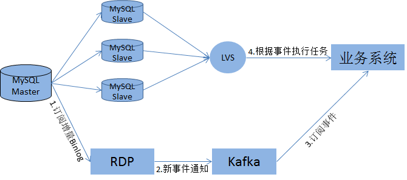
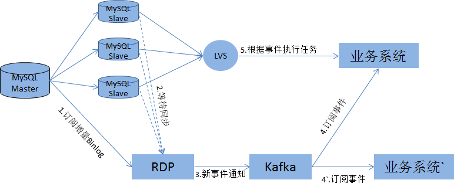

# RDP快速开始
## 1. RDP简介
数据订阅服务RDP(Real-time Data Pipeline)

- 我们不生产数据，我们只是数据搬运工

RDP同步数据库Binlog数据，经事务边界解析、Binlog翻译、过滤、分包、压缩、打包等操作，最终生成Protobuf格式序列化数据，推送至下游消息系统。

RDP系统架构图如下：


 - 数据源：RDP模拟Slave的同步方式，加入数据库的同步结构，既可以作为Master的Slave，也可以作为Slave的Slave。支持的数据库版本包括MySQL(version>5.7.19)，MariaDB(version>10.0.21).
 - Zookeeper：通过Zookeeper进行选主，在异常时自动进行主从切换，保证持续服务。定时记录同步进度，加快服务恢复。
 - RDP：主从多节点模式，多线程并发解析Binlog，保证数据实时性。
 - Schema Store & Execute DB：Schema Store存储源数据库表结构镜像，Execute DB回放DML，每个RDP对应一个轻量级的数据库，用于回放Binlog中的DML，将Binlog对应的表结构存储于Schema Store，降低对Schema Store的操作。计算和存储分离，这样多个RDP共享一个高性能的Schema Store。
 - Kafka：RDP使用原生Kafka协议写到单个Topic单个Partition，保证数据顺序。(对于需要对分片数据库合并到一个Topic，建议不同分片数据库写到同一个Topic的不同Partition)。


## 2. RDP的应用场景

 - 数据同步：同步数据库Binlog数据，解析后写入VMS，业务消费VMS获取数据库增量数据。


 - 事件通知：通过RDP同步增量数据库数据至VMS，业务消费VMS，获取DataBase/Table/Column/Value的变动情况。



 - 读一致性事件通知：RDP会主动等待Slave的同步进度，等待指定Slave追上同步进度或者超过一定阈值，才将事务写到Kafka。



## 3. 接入要求

1. MySQL版本要求>=5.7.19, MariaDB>=10.0.21
2. 确保开始GTID
3. 确保开启Row格式binlog
4. 确保BINLOG_FORMAT为ROW格式
5. 确保BINLOG_ROW_IMAGE为FULL
6. 提供如下权限的用户:
```
GRANT SELECT, PROCESS, REPLICATION SLAVE, REPLICATION CLIENT, SHOW VIEW, EVENT ON *.* TO 'rdp'@'10.%' identified  by  ...;
```

## 4. 快速上手
执行以下命令，启动容器:

```
docker run -it firnsan/rdp
```
容器中已经包含RDP的二进制程序，路径在/apps/svr/rdp_syncer/base下。

进入容器后，参照[部署文档](./rdp-deployment.md)中2.3和2.4小节，修改配置文件后启动进程。

